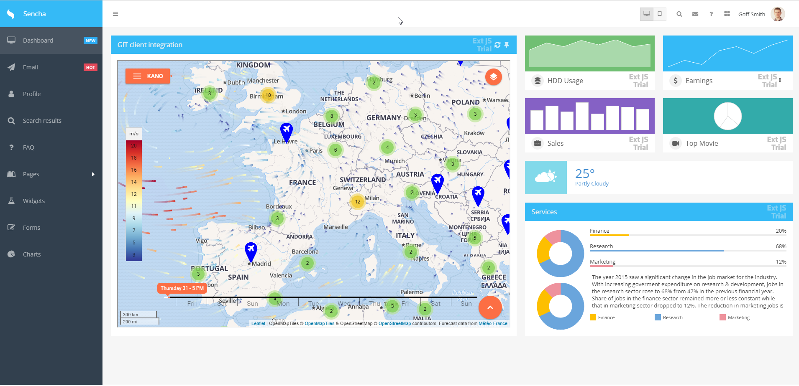

# IFrame integration

The [Kano](https://github.com/kalisio/kano) application is a map and weather forecast data explorer in 2D/3D built on top of the KDK. To avoid the burden of developping a completely new application for every mapping needs you might have, it has been designed to be integrated in your web application as an [`<iframe/>`](https://en.wikipedia.org/wiki/HTML_element#Frames) like this:



The iframe API is a subset of the internal Kano components API exposing:
* [2D map mixins](../kmap/mixins.md#map)
* [3D globe mixins](../kmap/mixins.md#globe)

It uses [post-robot](https://github.com/krakenjs/post-robot) to
1. select which is the target component
    * event name = `map` for 2D map and `globe` for 3D globe 
2. transform external method calls to internal calls using the following event payload
    * the `command` property is the mixin method name
    * the `args` property is the expected method arguments
3. retrieve internal method call result externally
    * event response data is the method result object

::: tip
Event messaging using post-robot is always async because it relies on the [postMessage API](https://developer.mozilla.org/en-US/docs/Web/API/Window/postMessage) under-the-hood.
:::

::: warning
In-memory data exchange is Json and more specifically GeoJson for map features. Do not try to inject functions or "complex" objects (e.g. class instances) in event payloads.
:::

In addition to the events used to access mixin methods there are a couple of dedicated events:
* `kano-ready`: to be listened by integrating application to know when the Kano application has been initialized in the iframe so that you can safely use the API
* `setLocalStorage`: listened by Kano to set key/value pairs (provided as event data payload) in its local storage, typically useful to inject access tokens
* `setConfiguration`: listened by Kano to override key/value pairs (provided as event data payload) in its default configuration, typically useful to setup UI according to your application needs, see the [detailed configuration page](./configuration.md)
* `map-ready`: to be listened by integrating application to know when the 2D map component has been initialized in the Kano application so that you can safely use the underlying API
* `globe-ready`: to be listened by integrating application to know when the 3D globe component has been initialized in the Kano application so that you can safely use the underlying API
* `layer-added`: to be listened by integrating application to know whenever a new layer has been added to the 2D/3D map (from the internal catalog or externally)
* `layer-removed`: to be listened by integrating application to know whenever a layer has been removed from the 2D/3D map
* `layer-shown`: to be listened by integrating application to know whenever a layer has been shown in the 2D/3D map
* `layer-hidden`: to be listened by integrating application to know whenever a new layer has been hidden in the 2D/3D map

Here is a simple code sample:
```html
  <script src="./post-robot.min.js"></script>
  <iframe id="kano" title="Kano" allow="geolocation *" style="width: 1024px; height: 768px;" src="kano.kalisio.com">
	<script>
	  var kano = document.getElementById('kano').contentWindow
	  // Wait for Kano to be initialized
	  postRobot.on('kano-ready', function() {
	  	// Optionnaly overrides default setup of Kano
	  	postRobot.send(kano, 'setConfiguration', { 'appName': 'xxx' })
	  	.then(function() {
		  	// Optionnaly set a valid token to avoid authentication
		  	postRobot.send(kano, 'setLocalStorage', { 'kano-jwt': 'xxx' })
		  	.then(function() {
				  // Show and zoom to a layer
			    postRobot.send(kano, 'map', { command: 'showLayer', args: 'Layer name' })
			    .then(function() {
			      postRobot.send(kano, 'map', { command: 'zoomToLayer', args: 'Layer name' })
			    })
			  })
			})
	  })
	</script>
```

A full sample exploring the different ways to interact with the API is provided [here](https://github.com/kalisio/kano/blob/master/src/statics/iframe.html). When running the demo you can dynamically call API methods when toggling the different buttons on the left.

