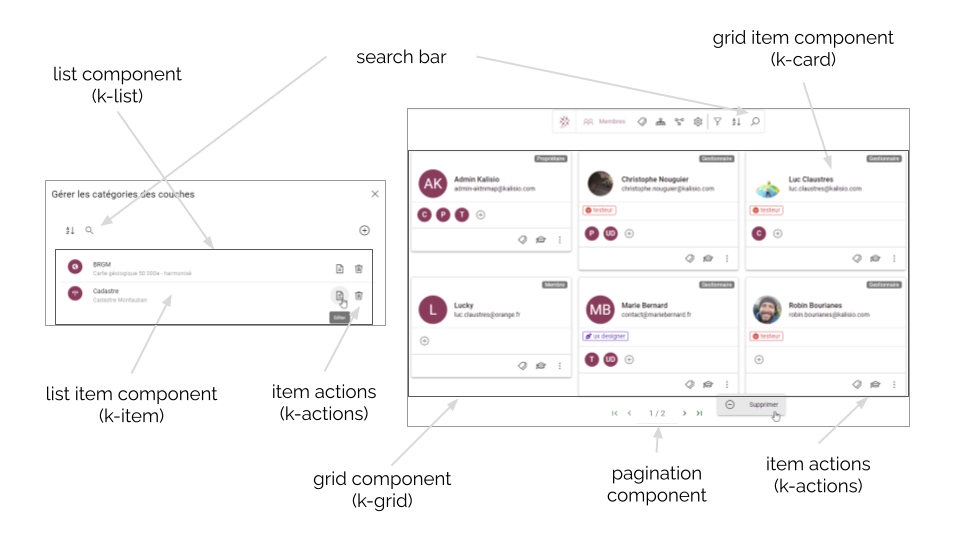
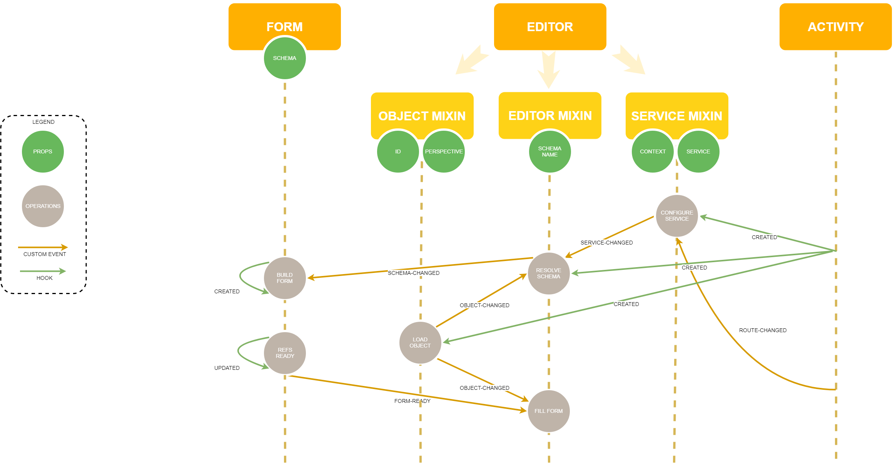

# Components

## Activity

An **activity** is the entry point used in applications for interacting with the user using business specific components. It usually represents a single screen with a user interface. For example, an email app might have one activity that shows a list of new emails, another activity to compose an email, and another activity for reading emails. Although the activities work together to form a cohesive user experience in the email app, each one is independent of the others as much as possible. As such, you should be able to start any one of these activities within the application or from an external application by activating a given [route](https://router.vuejs.org/) (i.e. link/URL).

There is no generic activity component within the core module because activities are usually business/domain-specific components (you might find a lot of them in others modules or in applications). However, it facilitates the interactions between activities and application as you will see hereafter.

## Layout

The basic application layout rely on [Material Design](https://material.io/), as illustred in our [Akt'n'Map](https://github.com/kalisio/aktnmap) application, and is the following:

The layout is flexible enough to only use part of it like e.g. the [Kano](https://github.com/kalisio/kano) application which is a map-centered UI with the following layout:

The **k-layout** component based on [QLayout](https://quasar-framework.org/components/layout.html) contains the elements that wrap application's content:
* **k-app-bar**: application bar shown on top of the page - can be overriden using the *header* slot
* **k-side-nav** : a left side navigation panel (which is shown alongside page content on wide screens) - can be overriden using the *left* slot
* **k-right-panel** : a right side panel (which can be shown alongside page content on wide screens) - can be overriden using the *right* slot
* **k-tab-bar**: a navigation with [QTabs](https://quasar-framework.org/components/tabs.html) - can be overriden using the *navigation* slot
* **k-fab**: an action button based on a [Quasar Floating Action Button](https://v0-14.quasar-framework.org/components/floating-action-button.html) at the bottom right corner of the page
* **k-search-bar**: a global search bar
* the embedded content of the page (i.e. the **Activity**) as a [router-view](https://router.vuejs.org/api/#router-view)

::: tip
The application layout is usually wrapped using the **k-home** component that simply load it depending on the authentication state of the user.
:::

Some layout components are fixed for the entire application lifecycle, as such they read their own setup from the [application configuration](../../guides/basics/step-by-step.md#frontend-side): layout, home, side navigation.

Some components are more dynamic and support to be updated depending on the current activity of the user: application bar, tab bar search bar, right panel, FAB. In this case the configuration is read from the [global store](./application.md#store) and any change watched to keep the components in sync.

::: tip
The best thing to do to learn how to configure your application is to have a look to the config files of our production applications like [Akt'n'Map](https://github.com/kalisio/aktnmap/blob/master/config/default.js) and [Kano](https://github.com/kalisio/kano/blob/master/config/default.js)
:::

## Collections

Most activities are used to list, search, edit (i.e. update) and remove data model items. To avoid a lot of boilerplate code the KDK provides you with built-in components to manage item collections either as list or grid as shown below:

### List

The **k-list** component is powered by [Quasar lists](https://quasar-framework.org/components/lists-and-list-items.html) and [Quasar pagination](https://quasar-framework.org/components/pagination.html). It also relies on the [service](./mixins.md#service) and [collection](./mixins.md#collection) mixins to manage its internal behaviour.

The following properties can be used to customize it:
* **renderer**:
  * **component**: the component to be used to render items (defaults to `collection/KItem`)
  * **options**: options of the rendrer,
  * **props**: properties to be bound to the item components
* **baseQuery**: the base query to be used when retrieving items from the target service
* **filterQuery**: the additional query parameters to be used to filter items according to current search criteria
* **listStrategy**: the update strategy used under the hood by [feathers-reactive](https://github.com/feathersjs-ecosystem/feathers-reactive)

The default **k-item** component is powered by the [base item mixin](./mixins.md#base-item) and provides you with the following properties:
* **item**: the object to be displayed
* **itemActions**: the list of actions available on the object, each action been described as
  * **label**: action label in the action menu
  * **route**: route to be pushed when action is triggerred
  * **handler**: function to be called when action is triggerred
* **options**: 
  * **icon**: icon to be used
  * **color**: icon color to be used
  * **avatar**: avatar image to be used
  * **nameField**: the name or path of the property used to retrieve the displayed name on the object, defaults to `name`
  * **descriptionField**: the name or path of the property used to retrieve the displayed description on the object, defaults to `description`
  
The default **k-item** component also provides you with the following slots will you need more customisation:
* `item-icon` or `item-avatar` to override icon or avatar section
* `item-content` to override content section
* `item-label` and `item-sublabel` to override labels section
* `item-actions` to override actions section

### Grid

The **k-grid** component is powered by [Flex](https://quasar-framework.org/components/flex-css.html), [Quasar cards](https://quasar-framework.org/components/card.html) and [Quasar pagination](https://quasar-framework.org/components/pagination.html). It also relies on the [service](./mixins.md#service) and [collection](./mixins.md#collection) mixins to manage its internal behaviour.

The same properties as with the **k-list** component can be used to customize it, the component to be used to render items defaults to `collection/KCard`.

The default **k-card** component is powered by the [base item mixin](./mixins.md#base-item) and provides you with the same properties as the **k-item** component but available slots are the following:
* `card-title` to override title section
* `card-icon` to override icon section
* `card-tags` to override tags section
* `card-content` to override content section
* `card-actions` to override actions section

However options of the **itemActions** are more complex:
* **pane**: the list of actions displayed in the pane, each action been described as
  * **name**: unique action name/ID
  * **icon**: action icon
  * **label**: action label in the action menu
  * **route**: route to be pushed when action is triggerred
  * **handler**: function to be called when action is triggerred
* **menu**: the list of actions displayed in the menu, each action been described as above

## Forms and editors

The **k-editor** (and its modal counterpart **k-modal-editor**) is a built-in editor, relying on different [mixins](./mixins.md) according to the following lifecycle:

