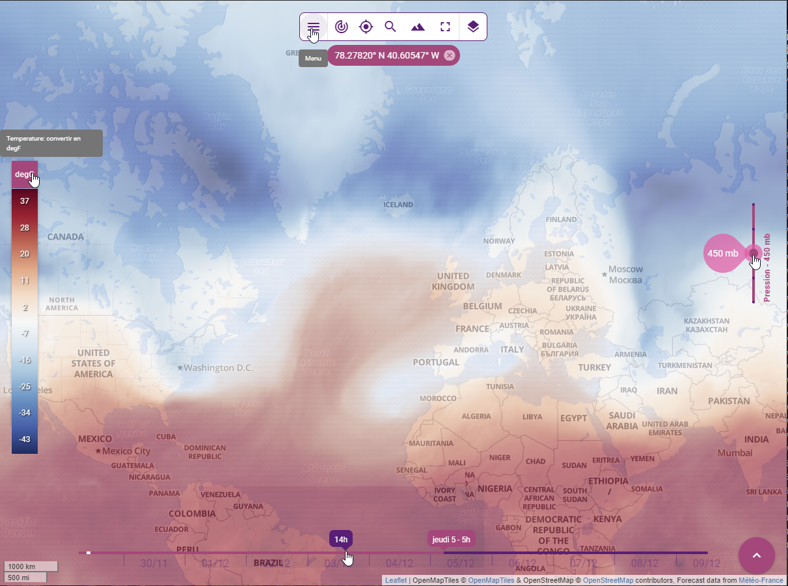

# Components

## Catalog panel

The **k-catalog-panel** is used to list all available layers in [catalog](./services.md#catalog-service) and organize them by category. A category is defined by the following properties:
* **name**: internal name,
* **label**: display label,
* **icon**: display icon,
* **options**:
  * **exclusive**: `true` if layer selection in the category should be exclusive (defaults to `false`),
  * **filter**: a filter supported by [sift](https://github.com/crcn/sift.js) to select layers from the catalog belonging to the category

This component relies on some others internal components:
* **k-layers-panel** used to list all available layers of a given category
* **k-layers-selector** used to list a set of layers and manage the selection
* **k-forecast-models-selector** used to list all available weather forecast models for related weather layers

## Color legend

The **k-color-legend** is used to display the legend associated to color mapped layers in [catalog](./services.md#catalog-service) and allow to switch between different display units whenever required.

::: tip
Will automatically hide/show whenever a layer with appropriate configuration is hidden/shown.
:::

## Level slider

The **k-level-slider** is used to display [available levels](./mixins.md#levels) on e.g. weather layers and allow to switch between them whenever required.

::: tip
Will automatically hide/show whenever a layer with appropriate configuration is hidden/shown.
:::

## Location timeseries

The **k-location-time-series** is used to display weather probes or measurements at specific locations as a set of timeseries graphs in mapping activities [catalog](./services.md#catalog-service) and allow to show/hide relevent elements.

Here is a view of the widget:

The main methods are the following:
* **createProbedLocationLayer()** updates the marker layer used to locate the probe measurements come from
* **updateProbedLocationForecast()** updates the probe prediction values whenever the current forecast model has changed (see [Weacast mixin](./mixins.md#weacast))
* **isTimeseriesOpen()** check if the timeseries widget is currently visible
* **openTimeseries()** opens the timeseries widget to make it currently visible
* **closeTimeseries()** closes the timeseries widget to make it currently hidden
* **toggleTimeseries()** changes the visibility state of the timeseries widget

::: tip
The component keeps in sync the timeseries widget visibility state and the associated probe marker layer.
:::

## Location indicator

The **k-location-indicator** is used to display the geographical coordinates of the current mouse position.

::: warning
To be used with the [location indicator mixin](./mixins.md#location-indicator).
:::

## Timeline

The **k-timeline** is used to display the time range of the weather prediction model associated to a [weather layer](./mixins.md#weacast). It allows to jump in time whenever required.

The main methods are the following:
* **setupTimeline()** setups the timeline according to currently selected forecast model time range if any (see [Weacast mixin](./mixins.md#weacast)) or based on the following global frontend [configuration](../../guides/basics/step-by-step.md#configuring-a-kapp) properties:
 * **start**: offset in seconds from now the timeline should begin
 * **end**: offset in seconds from now the timeline should end
* **getTimelineInterval()** default timeline interval function
* **getTimelineFormatter()** default timeline formatting function

## Navigation Bar

The **k-navigation-bar** groups together the main actions available on a [mapping activity](./mixins.md#activity). See e.g. [Kano configuration options](../kano/configuration.md) for more details.

Here is a view of some of the components presented previously:

## Map

Although some dedicated components do exist, you usually rely on provided [mixins](./mixins.md#map) to build your own map.

Kano provides a good starting point to build your own [Map Activity](https://github.com/kalisio/kano/blob/master/src/components/MapActivity.vue).

### Location

The **k-location-map** allows to display a location on a map using a marker.

The **k-location-field** provides you with an autocomplete address search input powered by the [geocoder service](./services.md#geocoder-service) to be embedded in a [**k-form**](../kcore/components.md#forms).

### Level slider

The **k-level-slider** allows to display a slider to select among a range of
value. It is meant to be used in conjunction with the [level mixin](./mixins.md#level).

## Globe

No dedicated component exist at the moment, you usually rely on provided [mixins](./mixins.md#globe) to build your own globe.

Kano provides a good starting point to build your own [Globe Activity](https://github.com/kalisio/kano/blob/master/src/components/GlobeActivity.vue).
