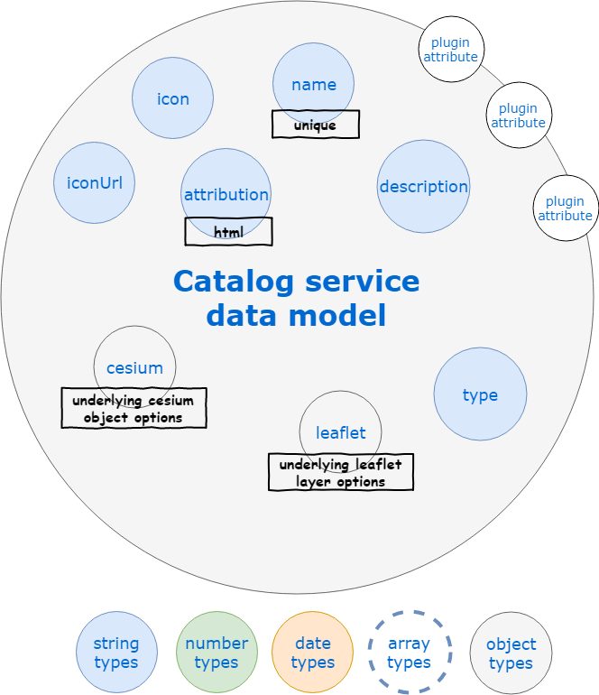
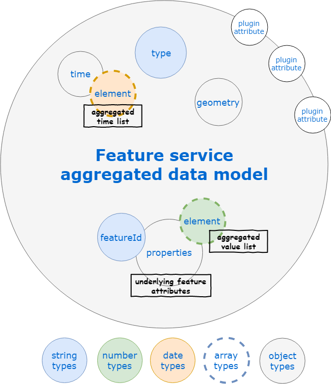

# Services

## Geocoder service

::: tip
Available as a global service
:::

::: warning
`create` method is the only one allowed from the client/server side
:::

Rely on [node-geocoder](https://github.com/nchaulet/node-geocoder) under-the-hood.

### Data model

The data model of a geocoding request as used by the API only contains the **address** field specifying the string to be looked for. The request response depends on the geocoding provider although there is a set of common properties, see example below.

```javascript
const service = app.getService('geocoder')
const results = await service.create({ address: '29 champs elysée paris' })
results.forEach(element => {
  let { latitude, longitude, country, state,
  		streetNumber, streetName, city, zipcode } = element
  ...
})
```

### Hooks

No [hooks](./hooks.md) are executed on the `geocoder` service for now.

## Catalog service

::: tip
Available as a global service
:::

### Data model

The data model of a layer descriptor as used by the API is detailed below.



The catalog is typically populated at application startup with a default set of layers, as a consequence the best is to have a look at some of our application configuration files like the one of [Kano](https://github.com/kalisio/kano/blob/master/api/config/layers.js).

The `type` and `tags` attributes are typically used by the [layers panel](./components.md#layers-panel) to organize the layer selection in a meaningful way.

### Hooks

The sole [hook](./hooks.md) executed on the `catalog` service is one that sets the default query type to layer (ie `$ne: 'service'`) when not provided.

## Feature service

::: tip
Available as a global and a contextual service
:::

### Data model

The common model is a [GeoJSON feature](https://tools.ietf.org/html/rfc7946#section-3.2) with [GeoJSON point geometry](https://tools.ietf.org/html/rfc7946#section-3.1.2). However, it also supports time-stamped features to manage the temporal evolution of either the geometry (e.g. a moving aircraft) or the attributes/properties (e.g. a probe). As a consequence it also usually contains the following:
* **time** : the date/time of the "measure" that produced the feature

The raw data model of a feature (ie when no aggregation is performed) as used by the API is detailed below.


### Time-based feature aggregation

Sometimes it is useful to retrieve a single result aggregating all the times for a given feature instead of multiple single results (i.e. one per time). You can perform such an aggregation based on [MongoDB capabilities](https://docs.mongodb.com/manual/core/aggregation-pipeline/) like this:

**TBC**

```javascript
let result = await app.getService('features').find({
  query: {
    time: { // Target time range
      $gte: '2017-05-24T12:00:00.000Z',
      $lte: '2017-05-25T12:00:00.000Z'
    },
    $groupBy: 'properties.iata_code', // Will perform aggregation based on this unique feature identifier
    'properties.iata_code': 'LFBO', // The target feature to aggregate, if omit all will be or you can provide a list with $in
    $aggregate: ['geometry', 'speed'] // List of properties to aggregate over time
  }
})
// Do something with the aggregated feature
```

When performing aggregation, **time** will become an object containing a key per aggregated element according to its name (e.g. `geometry`, `speed`). The value of each key will be the ordered list of available times for the element (unless you specified a different `$sort` order). The value of each aggregated element property (e.g. `properties.speed`) will become an array of values ordered according to ascending time (replacing the scalar property of the raw feature). 

The data model of a feature as returned by the API when some elements of the feature are aggregated over time is detailed below.



### Advanced feature filtering

Features are spatially indexed based on [MongoDB capabilities](https://docs.mongodb.com/manual/applications/geospatial-indexes/). So you can perform a [geospatial query](https://docs.mongodb.com/manual/reference/operator/query-geospatial/) on your results like this:

```javascript
import api from 'src/api'

const collection = await app.getService('features').find({
  query: {
    geometry: {
      $near: {
        $geometry: {
          type: 'Point',
          coordinates: [longitude, latitude]
        },
        $maxDistance: 10000 // in meters, i.e. 10 Kms around
      }
    }
  }
})
// Do something with the resulting feature collection
```

Such a complex query is fine when using the [Feathers isomorphic API](https://docs.feathersjs.com/api/client.html#universal-isomorphic-api) but if to be expressed manually as REST you have to convert nested objects to array notation like this: `/api/features?probeId=59248de38bb91d28d8155b3c&forecastTime=2017-05-27T07:00:00.000Z&geometry[$near][$maxDistance]=1000000&geometry[$near][$geometry][type]=Point&geometry[$near][$geometry][coordinates][]=5&geometry[$near][$geometry][coordinates][]=43`.

You can also filter results according to the computed element values by using the [Feathers common database query API](https://docs.feathersjs.com/api/databases/querying.html), e.g. to get results with a speed between 2 m/s and 5 m/s:

```javascript
import api from 'src/api'

const collection = await api.getService('features').find({
  query: {
    'properties.speed': {
      $gte: 2,
      $lte: 5
    }
  }
})
// Do something with the resulting feature collection
```

### Hooks

The following [hooks](./hooks.md) are executed on the `feature` service:

**TODO**