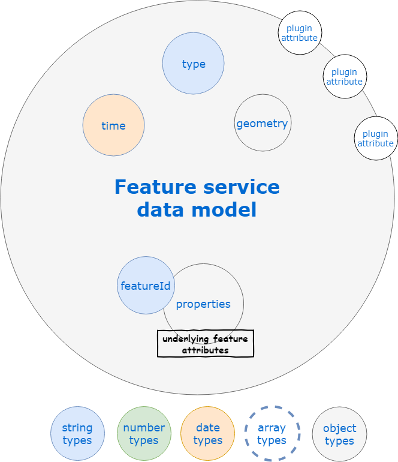
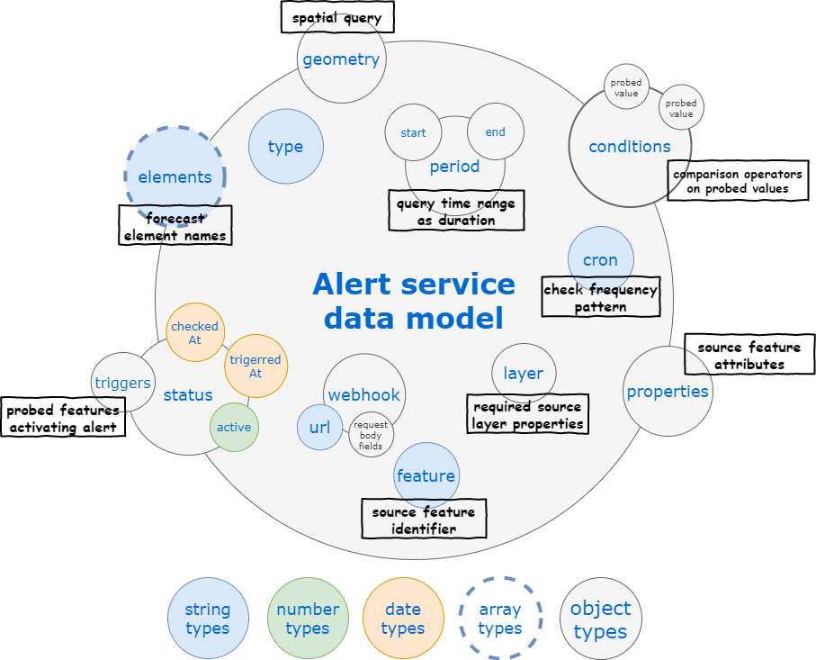

# Services

## Geocoder service

::: tip
Available as a global service
:::

::: warning
`create` method is the only one allowed from the client/server side
:::

Rely on [node-geocoder](https://github.com/nchaulet/node-geocoder) under-the-hood.

### Data model

The data model of a geocoding request as used by the API only contains the **address** field specifying the string to be looked for. The request response depends on the geocoding provider although there is a set of common properties, see example below.

```javascript
const service = app.getService('geocoder')
const results = await service.create({ address: '29 champs elysée paris' })
results.forEach(element => {
  let { latitude, longitude, country, state,
  		streetNumber, streetName, city, zipcode } = element
  ...
})
```

### Hooks

No [hooks](./hooks.md) are executed on the `geocoder` service for now.

## Catalog service

::: tip
Available as a global and a contextual service
:::

The service can be created using the global **createCatalogService(context, db)** function, if no arguments provided it will be available as a global service otherwise as a contextual service (e.g. attached to a specific organization), please also refer to core module [**createService()**](../core/application.md#createservice-name-options).

Here is a sample code to retrieve all data layer descriptors available in the catalog:
```javascript
const catalogService = app.getService('catalog')
let response = await catalogService.find()
_.forEach(response.data, (layer) => {
	if (layer[engine]) {
	  // Process i18n if you'd like to
	  if (this.$t(layer.name)) layer.name = this.$t(layer.name)
	  if (this.$t(layer.description)) layer.description = this.$t(layer.description)
	  // Create the underlying layer object in the map/globe
	  this.addLayer(layer)
	}
})
```

### Data model

The data model of a layer descriptor as used by the API is detailed below.


The catalog is typically populated at application startup with a default set of layers, as a consequence the best is to have a look at some of our application configuration files like the one of [Kano](https://github.com/kalisio/kano/blob/master/api/config/layers).

The details of each property are the following:
* **name** : the layer name, typically used in the [catalog panel](./components.md#catalog-panel)
* **description** : the layer short description, typically used in the [catalog panel](./components.md#catalog-panel)
* **i18n**: layer translations, see [application internationalization](../core/application.md#client-ecosystem) for details
  * **locale**: translations for a target locale eg `FR`
     * **Layers**: translation keys/values for layer fields
     * **Variables**: translation keys/values for variable fields
* **type** : usually `BaseLayer` for map backgrounds, `TerrainLayer` for 3D terrain, `OverlayLayer` for additionnal data layers
* **tags** : list of tags (i.e. array of strings) used to classify the layer
* **icon** : a [Quasar icon](https://quasar.dev/options/app-icons) for the layer, typically used in the [layers panel](./components.md#layers-panel)
* **iconUrl** : a link to an image to be used as icon for the layer, typically used in the [layers panel](./components.md#layers-panel)
* **attribution** : data attribution informaiton to be displayed along with the layer
* **leaflet** : options to be passed to the underlying Leaflet layer constructor
  * **type**: the type of Leaflet layer to be constructed (i.e. class/constructor function name), e.g. `tileLayer` or `geoJson`
  * **source**: if provided this property is reserved for the first argument to be passed to the underlying Leaflet layer constructor, typically the URL or the GeoJson data, in this case the options will be passed as the second argument
  * **option**: all others fields are considered as options to be passed to the layer constructor
* **cesium**: options to be passed to the underlying Cesium layer constructor
  * **type**: the type of Cesium layer to be constructed (i.e. class/constructor function name), e.g. `EllipsoidTerrainProvider` or `BingImageryProvider`
  * **option**: all others fields are considered as options to be passed to the layer constructor

::: tip
The `type` and `tags` attributes are typically used by the [catalog panel](./components.md#catalog-panel) to organize the layer selection in a meaningful way.
:::

If the layer is a feature layer based on a [feature service](./services.md#feature-service) the additional properties are the following:
* **service**: the name of the underlying feature service,
* **probeService**: the name of the underlying feature service containing probe locations,
* **featureId**: the name of the unique feature identifier in feature (relative to the nested `properties` object),
* **history**: the expiration period for stored feature
* **variables**: array of available properties in feature to be [aggregated over time](./services.md#time-based-feature-aggregation), for each entry the following options are available:
  * **name**: property name in feature (relative to the nested `properties` object),
  * **label**: property label to use in UI,
  * **units**: array of target units to be available in the legend, the first unit is the one used to store the data, others will be converted from using [math.js](http://mathjs.org/docs/datatypes/units.html)
  * **chartjs**: options to be passed to [chart.js](https://www.chartjs.org/docs/latest/charts/line.html#dataset-properties) when drawing timeseries

### Hooks

The sole [hook](./hooks.md) executed on the `catalog` service is one that sets the default query type to layer (ie `$ne: 'service'`) when not provided.

## Features service

::: tip
Available as a global and a contextual service
:::

The service can be created using the global **createFeaturesService(options)** function, if no context provided it will be available as a global service otherwise as a contextual service (e.g. attached to a specific organization), please also refer to core module [**createService()**](../core/application.md#createservice-name-options).

### Data model

The common model is a [GeoJSON feature](https://tools.ietf.org/html/rfc7946#section-3.2) with [GeoJSON point geometry](https://tools.ietf.org/html/rfc7946#section-3.1.2). However, it also supports time-stamped features to manage the temporal evolution of either the geometry (e.g. a moving aircraft) or the attributes/properties (e.g. a probe). As a consequence it also usually contains the following:
* **time** : the date/time of the "measure" that produced the feature

The raw data model of a feature (ie when no aggregation is performed) as used by the API is detailed below.



### Time-based feature aggregation

Sometimes it is useful to retrieve a single result aggregating all the times for a given feature instead of multiple single results (i.e. one per time). You can perform such an aggregation based on [MongoDB capabilities](https://docs.mongodb.com/manual/core/aggregation-pipeline/) like this:

```javascript
let result = await app.getService('features').find({
  query: {
    time: { // Target time range
      $gte: '2017-05-24T12:00:00.000Z',
      $lte: '2017-05-25T12:00:00.000Z'
    },
    $groupBy: 'properties.iata_code', // Will perform aggregation based on this unique feature identifier
    'properties.iata_code': 'LFBO', // The target feature to aggregate, if omitted all will be or you can provide a list with $in
    $aggregate: ['geometry', 'speed'] // List of properties to aggregate over time
  }
})
// Do something with the aggregated feature
```

When performing aggregation, **time** will become an object containing a key per aggregated element according to its name (e.g. `geometry`, `speed`). The value of each key will be the ordered list of available times for the element (unless you specified a different `$sort` order). The value of each aggregated element property (e.g. `properties.speed`) will become an array of values ordered according to ascending time (replacing the scalar property of the raw feature). 

The data model of a feature as returned by the API when some elements of the feature are aggregated over time is detailed below.


### Advanced feature filtering

Features are spatially indexed based on [MongoDB capabilities](https://docs.mongodb.com/manual/applications/geospatial-indexes/). So you can perform a [geospatial query](https://docs.mongodb.com/manual/reference/operator/query-geospatial/) on your results like this:

```javascript
import api from 'src/api'

const collection = await app.getService('features').find({
  query: {
    geometry: {
      $near: {
        $geometry: {
          type: 'Point',
          coordinates: [longitude, latitude]
        },
        $maxDistance: 10000 // in meters, i.e. 10 Kms around
      }
    }
  }
})
// Do something with the resulting feature collection
```

Such a complex query is fine when using the [Feathers isomorphic API](https://docs.feathersjs.com/api/client.html#universal-isomorphic-api) but if to be expressed manually as HTTP REST request you have to convert nested objects to array notation like this: `/api/features?probeId=59248de38bb91d28d8155b3c&forecastTime=2017-05-27T07:00:00.000Z&geometry[$near][$maxDistance]=1000000&geometry[$near][$geometry][type]=Point&geometry[$near][$geometry][coordinates][]=5&geometry[$near][$geometry][coordinates][]=43`.

The service also supports some shortcuts for the most useful types of spatial requests:
* *proximity filter* will trigger a [`$near`](https://docs.mongodb.com/manual/reference/operator/query/near/) or [`$geoNear`](https://docs.mongodb.com/manual/reference/operator/aggregation/geoNear/) operation (if aggregation is performed)
  * **centerLon**: location longitude
  * **centerLat**: location latitude
  * **distance**: query distance from location in meters
* *bounding box filter* will trigger a [`$geoIntersects`](https://docs.mongodb.com/manual/reference/operator/query/geoIntersects/) operation
  * **south**: south coordinates of the bounding box in degrees
  * **north**: north coordinates of the bounding box in degrees
  * **west**: west coordinates of the bounding box in degrees
  * **east**: east coordinates of the bounding box in degrees

::: warning
Complex spatial queries can raise an issue when using REST HTTP requests due to their length, in that case use shortcuts presented above.
:::

You can also filter results according to the computed element values by using the [Feathers common database query API](https://docs.feathersjs.com/api/databases/querying.html), e.g. to get results with a speed between 2 m/s and 5 m/s in a given area:

```javascript
import api from 'src/api'

const collection = await api.getService('features').find({
  query: {
    'properties.speed': {
      $gte: 2,
      $lte: 5
    },
    south: 45,
    north: 50,
    west: 5,
    east: 10
  }
})
// Do something with the resulting feature collection
```

### Hooks

The following [hooks](./hooks.md) are executed on the `features` service:


## Alerts service

::: tip
Available as a global and a contextual service
:::

The service can be created using the global **createAlertsService(options)** function, if no context provided it will be available as a global service otherwise as a contextual service (e.g. attached to a specific organization), please also refer to core module [**createService()**](../core/application.md#createservice-name-options).

Alerts are user-defined conditions automatically and continuously evaluated as new time-based data are gathered and target sensor measures or forecast data. It can be viewed as an automated query of the [feature aggregation API](./services.md#feature-service) or [Weacast probe API](https://weacast.github.io/weacast-docs/api/probe.html#probes-api) that will raise an event or trigger a webhook whenever a matching result is found. With alerts you can create triggers which will fire on an occurrence of the selected measure or weather conditions (temperature, humidity, pressure, etc.) in a specified location and period of time.

### Data model

The common model is a [GeoJSON feature](https://tools.ietf.org/html/rfc7946#section-3.2) with the geometry of the source feature for measurements or a [GeoJSON point](https://tools.ietf.org/html/rfc7946#section-3.1.2) for weather.

The data model of an alert as used by the API is detailed below.



The details of some of the properties are the following:
* **cron**: a [CRON pattern](https://github.com/kelektiv/node-cron) to schedule the alert check at regular intervals, e.g. `* 0 * * * *` will run it every minute
* **feature**: the ID of the feature to be checked by the alert
* **layer**: the layer object owing the feature to be checked by the alert
* **elements**: array of names corresponding to the probed forecast element values to be checked by the alert (each element has to be declared in the [weacast configuration](https://weacast.github.io/weacast-docs/guides/basics.html#configuring))
* **period**: time interval used to do the matching between the forecast data and the trigger conditions
  * **start**: offset which needs to be added to the current timestamp at the moment of validation to compute the beginning of the time interval used to check the conditions, specified as [moment.js duration object](https://momentjs.com/docs/#/manipulating/add/)
  * **end**: offset which needs to be added to the current timestamp at the moment of validation to compute the end of the time interval used to check the conditions, specified as [moment.js duration object](https://momentjs.com/docs/#/manipulating/add/)
* **conditions**: query specification which contains nested objects:
  * **[probed element]**: for each checked element a filter according to the probed values specified using the [Feathers common database query API](https://docs.feathersjs.com/api/databases/querying.html)
* **geometry** specification of a [geospatial query](https://docs.mongodb.com/manual/reference/operator/query/geoWithin/)
* **webhook**: webhook to be triggered
  * **url**: webhook target URL
  * **xxx**: request body field values that will be POST on the URL

  ### Hooks

The following [hooks](./hooks.md) are executed on the `alerts` service:

